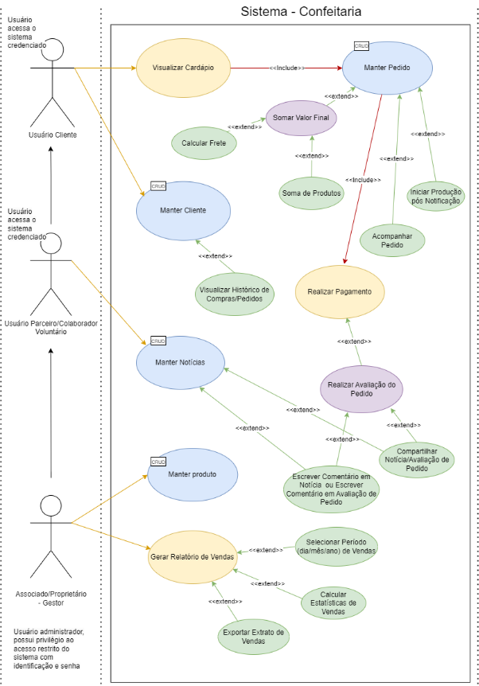

# Diagrama de Caso de Uso

## Descrição de Caso de Uso

**Caso de uso Principal:  Realizar pedido - Situação 01**

1. Ator usuário *Cliente*: visualiza o cardápio disponibilizado.
1. Inicia o processo de criação de um pedido.
1. O usuário *Cliente* seleciona os produtos desejados.
1. O sistema calcula o valor total do pedido com base na soma dos produtos + valor do frete.
1. O sistema notifica o usuário *Proprietário/Associado* para iniciar a produção do produto.
1. O sistema permite ao usuário *Cliente* acompanhar o pedido.
1. O usuário *Cliente* realiza o pagamento.
1. O sistema registra nota fiscal com base nos dados fornecidos pelo usuário *Cliente.*
1. O sistema permite ao usuário *Cliente* realizar a avaliação do pedido.

**Caso de uso Principal:  Gerar Relatório de Vendas - Situação 02**

1. Sistema permite que o usuário *Proprietário* gere relatórios de vendas.
1. O sistema permite que o usuário *Proprietário* selecione o período do relatório.
1. O sistema calcula as estatísticas e exibe no formato de relatório.
1. O sistema exibe a quantidade de produtos vendidos, quais foram mais vendidos, suas descrições e a soma total arrecadada.
1. O sistema permite ao usuário *Proprietário* exportar o extrato/relatório;