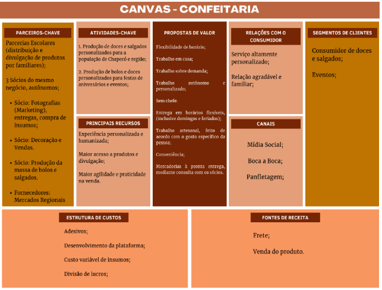

# Descrição do Projeto

O site será projetado para oferecer aos clientes uma experiência digital intuitiva e informativa, facilitando o acesso aos produtos da padaria, informações sobre localização e horário de funcionamento. Buscamos criar uma plataforma que promova a marca da padaria, aumente a visibilidade online e melhore a conveniência para nossos clientes

## Visão Geral do Projeto

O projeto visa gerar praticidade e agilidade na forma de gerir a empresa por meio de seus proprietários, enquanto também visa gerar facilidade para seus clientes realizarem pedidos de forma online, beneficiando funcionários, gerentes e  clientes. O site serve para realizar compras e encomendas online, criar posts gerando engajamento entre os clientes.

### Canvas do Projeto (visão geral do projeto)

## Stakeholders

\- Funcionários;

\- Clientes; 

\- Fornecedores (mercados regionais);

\- Desenvolvedores;

\- Laíz Eduarda Schneider - Associada/Proprietária;

\- Gabriel Lopes da Silva - Associado/Proprietário;

\- Veridiany dos Santos Lopes - Associada/Proprietária.

## Objetivos

Nossos objetivos com a implementação deste site é um maior alcance sobre nossos clientes, visando aumentar gradativamente nossas vendas nos próximos 12 meses, além de facilitar a gestão dos gerentes e funcionários, otimizando tempo com relatórios de vendas, postagens, gerenciamento de produtos e pedidos.

